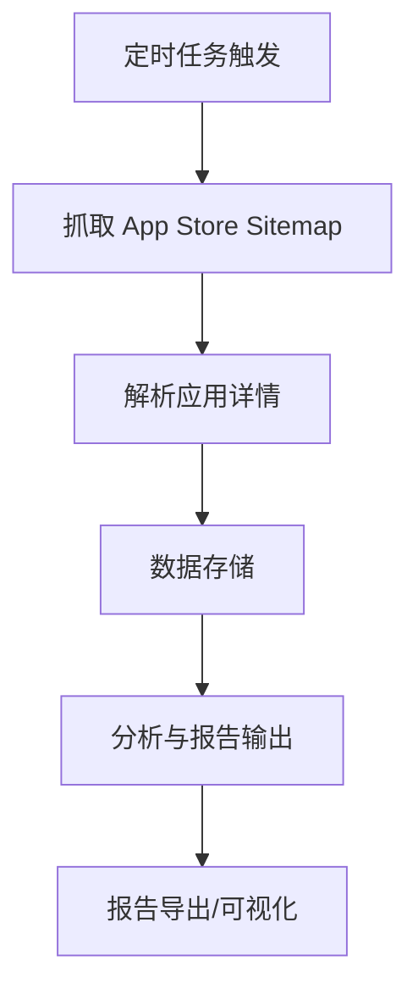

# App 收集分析工具 PRD（产品需求文档）

## 一、产品背景
随着移动互联网的快速发展，Apple App Store 应用数量激增，市场调研、竞品分析、应用归档等需求日益增长。手动收集和分析 App 数据效率低、易遗漏，亟需自动化、结构化的工具提升数据采集与分析能力。

## 二、目标用户
- 市场分析师、产品经理、运营人员
- 数据分析师、BI 团队
- 竞品研究、行业研究人员
- 需要批量采集、归档 App 数据的开发者

## 三、核心价值
- 自动化、批量化采集 App Store 应用数据，极大提升数据获取效率
- 支持多维度分析与报告输出，助力决策与趋势洞察
- 可扩展、易集成，适配多种业务场景

## 四、产品目标
- 实现 Apple App Store 应用数据的自动化、结构化采集与存储
- 支持定时调度、断点续采，保障大规模数据采集的稳定性
- 提供多维度分析与可视化报告，支持导出多种格式
- 具备良好的可扩展性与二次开发能力

## 五、功能模块说明
### 1. App Store Sitemap 自动追踪
- 定时抓取 Apple App Store 的 sitemap，自动发现新上架或更新的应用
- 支持自定义抓取频率（如每日、每周）
- 断点续采机制，防止重复抓取与数据遗漏

### 2. 应用数据解析与存储
- 解析应用详情：名称、ID、开发者、图标、描述、分类、发布时间、更新日期、价格、内容分级等
- 数据存储支持本地数据库（如 SQLite、CSV）或外部数据仓库
- 支持数据去重与增量更新

### 3. 多维度数据采集
- 支持按关键词、开发者、分类等多种方式批量采集应用信息
- 可配置采集规则，灵活筛选目标 App

### 4. 进度管理与断点续采
- 内置任务进度跟踪，采集中断后可自动恢复
- 支持采集日志记录与异常重试

### 5. 自动化调度与报告
- 集成定时任务（如 GitHub Actions、crontab），实现自动化采集与分析
- 自动统计并输出新增应用清单，支持按天/周/月生成报告
- 内置分析脚本，支持统计、趋势分析、可视化输出，报告可导出为 CSV、PDF 等格式

### 6. 可扩展性与自动化能力
- 支持自定义采集规则与扩展采集目标（如 Google Play、第三方应用市场）
- 可与现有数据分析平台或 BI 工具集成，便于后续深度分析
- 代码结构清晰，脚本化程度高，便于二次开发与自动化部署

### 7. 异常处理与日志
- 采集异常自动重试与告警
- 详细日志记录，便于问题追踪与定位

### 8. 未来规划
- 支持更多应用市场（如 Google Play）
- 增加数据可视化 Dashboard
- 支持 API 接口输出，便于系统集成
- 增强数据清洗与标签体系

## 六、技术架构与数据流程
- **数据采集层**：负责 sitemap 抓取与应用详情解析
- **数据存储层**：本地数据库/外部仓库，支持结构化存储
- **分析与报告层**：内置分析脚本，支持多维度统计与报告导出
- **自动化调度层**：定时任务、进度管理、异常处理

## 七、目录结构说明
- `scripts/parse-apps-from-sitemap.py`：核心 sitemap 解析与应用数据采集脚本
- `scripts/report_analysis.py`：数据分析与报告生成脚本
- `scripts/` 目录下包含自动化调度、数据处理等辅助脚本
- `input/prd.md`：详细产品需求与功能模块说明

## 八、适用场景
- 市场调研、竞品分析、应用趋势追踪、App 数据归档等
- 自动化数据采集与定期报告输出
- 结合 BI 工具进行深度分析

## 九、常见问题 FAQ
1. **如何自定义采集规则？**
   - 可在 `scripts/parse-apps-from-sitemap.py` 中修改采集参数，或通过配置文件指定。
2. **支持哪些数据导出格式？**
   - 支持 CSV、PDF 等主流格式，后续可扩展更多格式。
3. **如何扩展到其他应用市场？**
   - 参考现有采集脚本结构，新增目标市场的解析逻辑即可。
4. **采集过程中断怎么办？**
   - 工具内置断点续采与异常重试机制，可自动恢复。

## 十、联系方式
如需详细使用说明或二次开发指导，请参考 `scripts/` 目录下各脚本注释及 `input/prd.md` 产品文档。
如有疑问或合作需求，请联系：
- 邮箱：your_email@example.com
- 微信：your_wechat_id